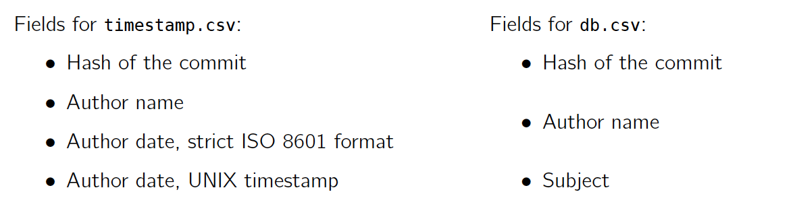

# LAB4

Wu Jiayao 517370910257

## 1.

### 1.1

$\textbf{timestamp.csv}$

~~~shell
git log --pretty="%H,%aN,%aI,%at" > timestamp.csv
~~~

$\textbf{db.csv}$

~~~shell
git log --pretty="%H,%aN,%s" > db.csv
~~~

### 1.2

#### What are the most common database systems?

1. Oracle Database
2. MySQL
3. Microsoft SQL Server
4. PostgreSQL
5. MongoDB

#### Briefly list the pros and cons of the three most common ones.

1. **Oracle database**

   pros: 

   - It's the most advanced technology
   - It offers a wide range of solutions

   Cons

   - It is an expensive solution
   - System upgrades is required for using Oracle

2.   **MySQL**

   pros: 

   -  It’s free
   - It's excellent for any size organization
   - There are different user interfaces
   - It's highly compatible with other systems

   Cons

   - Features common in other RDBMs(SQL-Based) is missing in MySQL
   - It's hard to get quality support

3.  **Microsoft SQL Server**

   pros: 

   -  It’s available on mobile  
   - It's fast
   - There are different user interfaces
   - It integrates with Microsoft products

   Cons

   - It's expensive
   - It requires a lot of resources

#### Create an empty SQLite database

~~~shell
sqlite3 zzz.db ".databases"
sqlite3 zzz.db
~~~

#### Use the SQLite shell to prepare two empty tables for each of your .csv file.

~~~sqlite
CREATE TABLE timestamp(
    HASH TEXT NOT NULL,
    NAME TEXT NOT NULL,
    TIME_ISO TEXT NOT NULL,
    TIME_UNIX INT NOT NULL
);
CREATE TABLE db(
    HASH TEXT NOT NULL,
    NAME TEXT NOT NULL,
    SUBJECT TEXT
);
~~~

#### Import each .csv file in its corresponding SQLite table.

~~~sqlite
.separator ","
.import db.csv db
.import timestamp.csv timestamp
~~~

### 2. Database queries

Assume that all the items in databases are in the correct format as

The number after the commas that follows the name is the times of apperance in database.

#### Who are the top five contributors to the Linux kernel since the beginning?

~~~sqlite
SELECT NAME, count( * ) AS times FROM timestamp
GROUP BY NAME
ORDER BY times DESC
LIMIT 5;
~~~

Linus Torvalds,28312

David S. Miller,11975

Mark Brown,7352

Takashi Iwai,6965

Arnd Bergmann,6893

### Who are the top five contributors to the Linux kernel for each year over the past five years?

Take this year as example. For other four years, use $'20XX-12-31'$

~~~sqlite
SELECT NAME, count( * ) AS times FROM timestamp where TIME_ISO Between '2019-01-01' and date('now')
GROUP BY NAME
ORDER BY times DESC
LIMIT 5;
~~~

**Year 2015:**

Linus Torvalds,2006

David S. Miller,983

H Hartley Sweeten,772

Arnd Bergmann,736

Geert Uytterhoeven,707

**Year 2016:**

Linus Torvalds,2273

Arnd Bergmann,1185

David S. Miller,1150

Chris Wilson,988

Mauro Carvalho Chehab,975

**Year 2017:**

Linus Torvalds,2288

David S. Miller,1420

Arnd Bergmann,1116

Chris Wilson,1027

Arvind Yadav,827

**Year 2018:**

Linus Torvalds,2163

David S. Miller,1405

Arnd Bergmann,893

Christoph Hellwig,818

Colin Ian King,797

 **Year 2019: **

Linus Torvalds,1878

David S. Miller,925

Thomas Gleixner,737

YueHaibing,707

Christoph Hellwig,684

### What is the most common “commit subject”?

~~~sqlite
SELECT SUBJECT, count ( * ) AS times FROM db
GROUP BY NAME
ORDER BY times DESC
LIMIT 1;
~~~

Merge branch 'linus' of git://git.kernel.org/pub/scm/linux/kernel/git/herbert/crypto-2.6,28276

#### On which day is the number of commits the highest?

~~~sqlite
SELECT date(TIME_ISO), count ( * ) AS times FROM timestamp
GROUP BY date(TIME_ISO)
ORDER BY times DESC
LIMIT 5;
~~~

   ,3967

2008-01-30,1013

2006-12-07,672

2007-05-08,643

2013-07-03,626

The answer should be 2008-01-30. The first one should be some cases that there are two fields for author names.

### Determine the average time between two commits for the five main contributor

Take Linus Torvalds as example.

~~~sql
SELECT MAX(TIME_UNIX) FROM timestamp where ( NAME = "Linus Torvalds" );
SELECT MIN(TIME_UNIX) FROM timestamp where ( NAME = "Linus Torvalds" );

SELECT ( SELECT MAX(TIME_UNIX) FROM timestamp where ( NAME = "Linus Torvalds" ) ) - ( SELECT MIN(TIME_UNIX) FROM timestamp where ( NAME = "Linus Torvalds" ) );

SELECT COUNT(TIME_UNIX) FROM timestamp where ( NAME = "Linus Torvalds" );
~~~

$$
Interval = \frac{MAX-MIN}{COUNT-1}
$$

Linus Torvalds: $457031904/28311=16143$ seconds

David S. Miller:$456547627/11974=38128$ seconds

Mark Brown: $429701525/7351=58454$ seconds 

Takashi Iwai: $457579663/6964=65706$ seconds

Arnd Bergmann: $453597626/6893=65815$ seconds